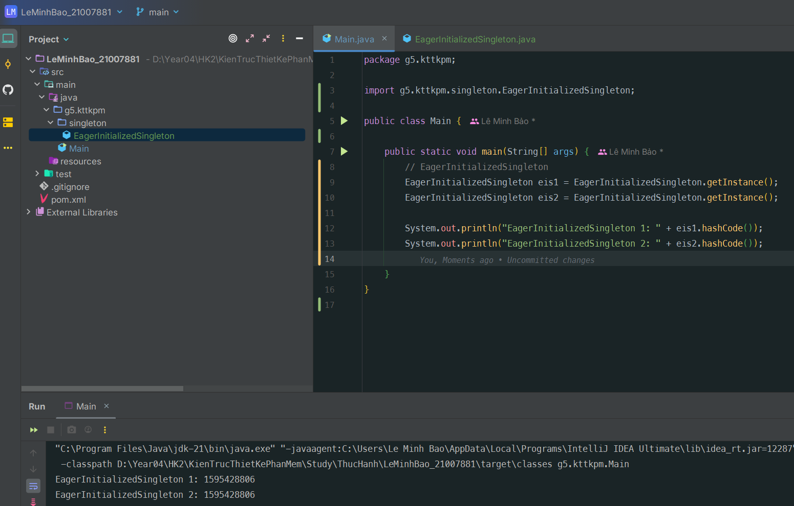
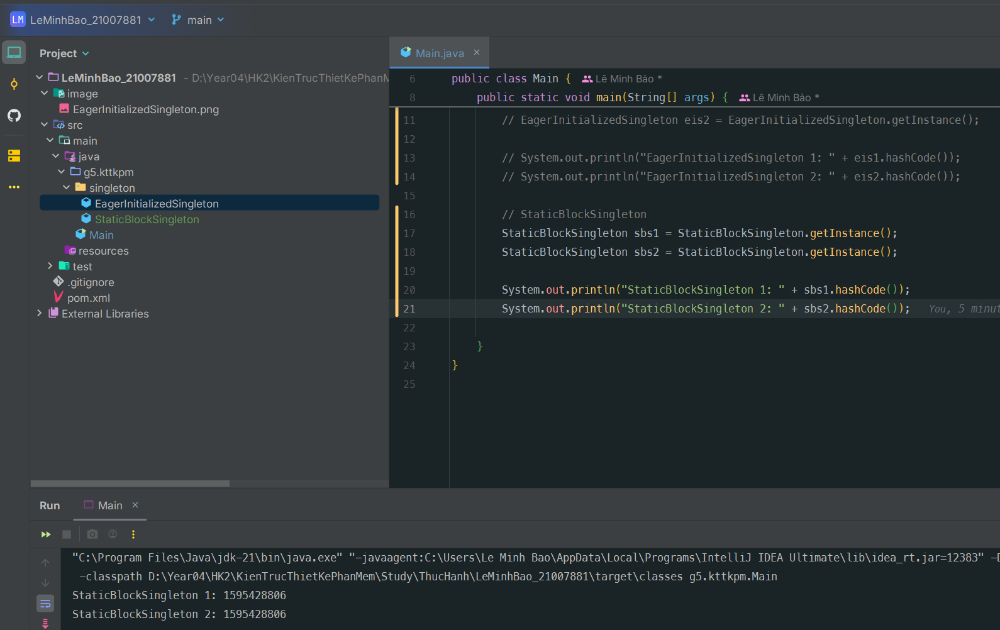
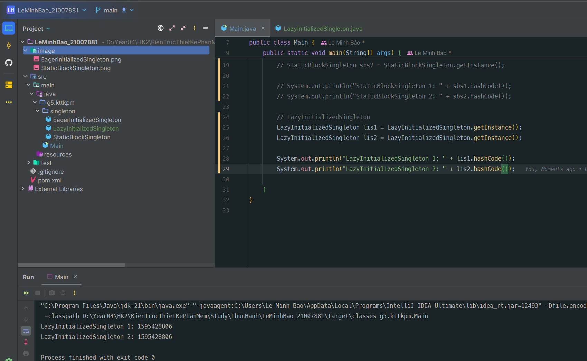
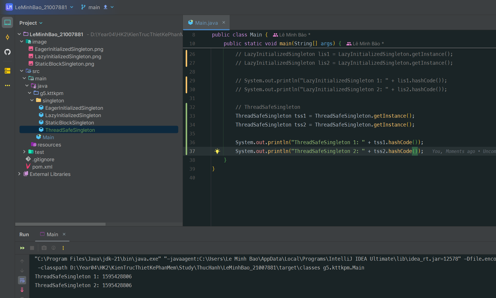
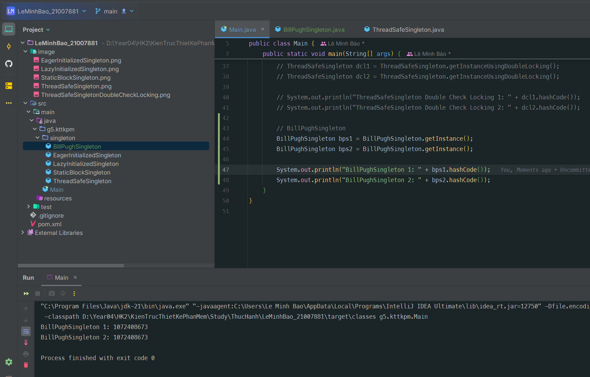
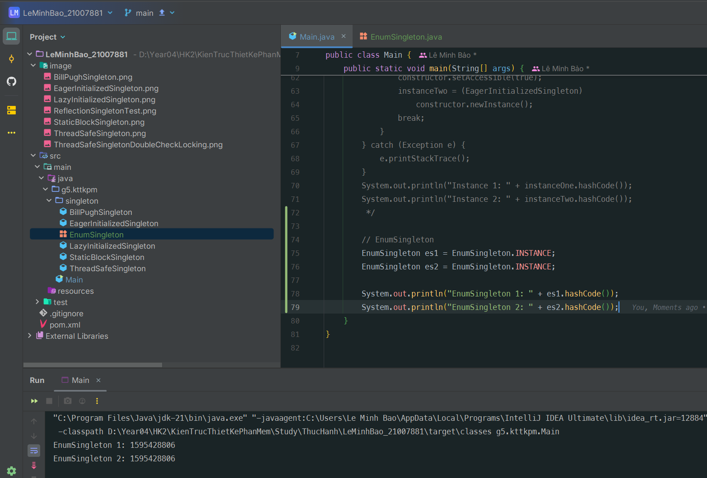
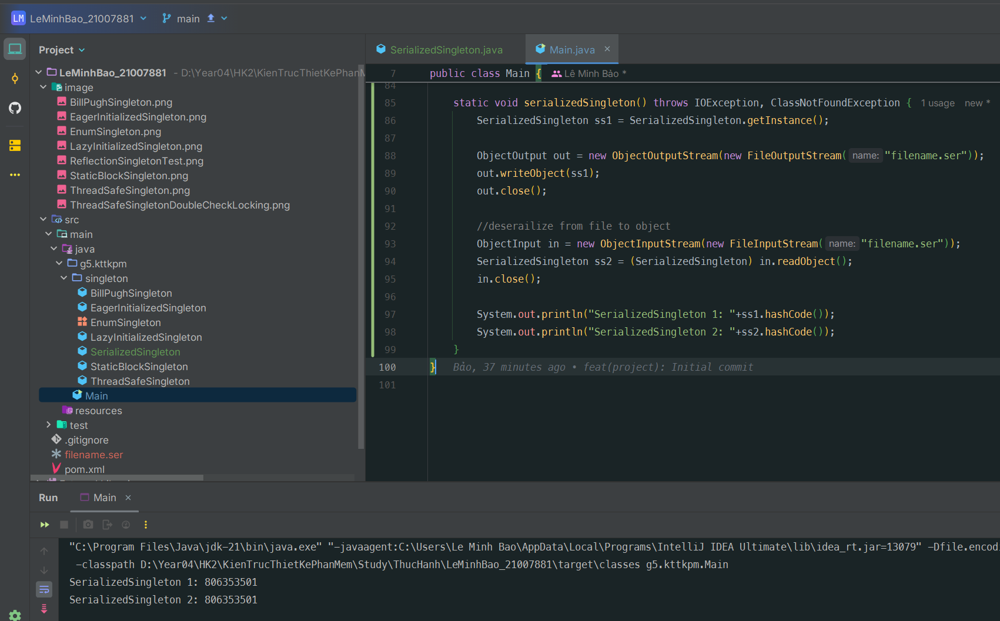

# Le Minh Bao - 21007881

<!-- TOC -->
* [Le Minh Bao - 21007881](#le-minh-bao---21007881)
  * [EagerInitializedSingleton](#eagerinitializedsingleton)
  * [StaticBlockSingleton](#staticblocksingleton)
  * [LazyInitializedSingleton](#lazyinitializedsingleton)
  * [ThreadSafeSingleton](#threadsafesingleton)
  * [BillPughSingleton](#billpughsingleton)
  * [ReflectionSingleton](#reflectionsingleton)
  * [EnumSingleton](#enumsingleton)
  * [SerializedSingleton](#serializedsingleton)
<!-- TOC -->

## EagerInitializedSingleton

### Class:

```java
package g5.kttkpm.singleton;

public class EagerInitializedSingleton {
    
    private static final EagerInitializedSingleton instance = new EagerInitializedSingleton();
    
    //private constructor to avoid client applications to use constructor
    private EagerInitializedSingleton() {
    }
    
    public static EagerInitializedSingleton getInstance() {
        return instance;
    }
}
```

### Image:


## StaticBlockSingleton

### Class:

```Java
package g5.kttkpm.singleton;

public class StaticBlockSingleton {
    private static final StaticBlockSingleton instance;
    
    private StaticBlockSingleton() {
    }
    
    //static block initialization for exception handling
    static {
        try {
            instance = new StaticBlockSingleton();
        } catch (Exception e) {
            throw new RuntimeException("Exception occured in creating singleton instance");
        }
    }
    
    public static StaticBlockSingleton getInstance() {
        return instance;
    }
}
```

### Image:


## LazyInitializedSingleton

### Class:

```Java
package g5.kttkpm.singleton;

public class LazyInitializedSingleton {
    private static LazyInitializedSingleton instance;
    
    private LazyInitializedSingleton() {
    }
    
    public static LazyInitializedSingleton getInstance() {
        if (instance == null) {
            instance = new LazyInitializedSingleton();
        }
        return instance;
    }
}
```

### Image:


## ThreadSafeSingleton

### Class:

```Java
package g5.kttkpm.singleton;

public class ThreadSafeSingleton {
    private static ThreadSafeSingleton instance;
    
    private ThreadSafeSingleton(){}
    
    public static synchronized ThreadSafeSingleton getInstance(){
        if(instance == null){
            instance = new ThreadSafeSingleton();
        }
        return instance;
    }
    
    public static ThreadSafeSingleton getInstanceUsingDoubleLocking(){
        if(instance == null){
            synchronized (ThreadSafeSingleton.class) {
                if(instance == null){
                    instance = new ThreadSafeSingleton();
                }
            }
        }
        return instance;
    }
}
```

### Image:


## BillPughSingleton

### Class:

```Java
package g5.kttkpm.singleton;

public class BillPughSingleton {
    private BillPughSingleton() {
    }
    
    private static class SingletonHelper {
        private static final BillPughSingleton INSTANCE = new BillPughSingleton();
    }
    
    public static BillPughSingleton getInstance() {
        return SingletonHelper.INSTANCE;
    }
}
```

### Image:


## ReflectionSingleton

### Class:

```Java
static void reflectionSingleton() {
    EagerInitializedSingleton instanceOne =
        EagerInitializedSingleton.getInstance();
    EagerInitializedSingleton instanceTwo = null;
    try {
        Constructor[] constructors =
            EagerInitializedSingleton.class.getDeclaredConstructors();
        for (Constructor constructor : constructors) {
            //Below code will destroy the singleton pattern
            constructor.setAccessible(true);
            instanceTwo = (EagerInitializedSingleton)
                constructor.newInstance();
            break;
        }
    } catch (Exception e) {
        e.printStackTrace();
    }
    System.out.println("Instance 1: " + instanceOne.hashCode());
    System.out.println("Instance 2: " + instanceTwo.hashCode());
}
```

### Image:


## EnumSingleton

### Class:

```Java
package g5.kttkpm.singleton;

public enum EnumSingleton {
    INSTANCE;
    
    public static void doSomething(){
        //do something
    }
}
```

### Image:


## SerializedSingleton

### Class:

```Java
package g5.kttkpm.singleton;

import java.io.Serializable;

public class SerializedSingleton implements Serializable {
    private static final long serialVersionUID = -7137382317372484280L;
    private SerializedSingleton(){}
    
    private static class SingletonHelper{
        private static final SerializedSingleton instance = new
            SerializedSingleton();
    }
    
    public static SerializedSingleton getInstance(){
        return SingletonHelper.instance;
    }
    
    protected Object readResolve() {
        return getInstance();
    }
}
```

### Image:



